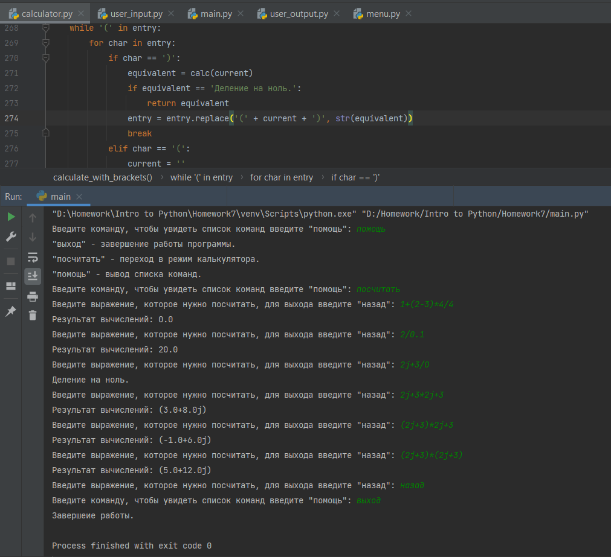
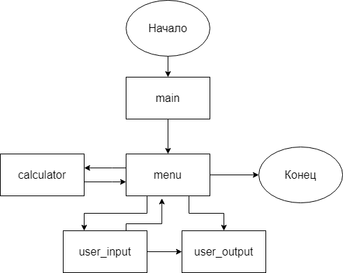

# Калькулятор с возможностью вычисления выражений с комплексными числами.

## Описание работы приложения.

Программа запускается через файл main.py, откуда сразу же вызывается функция open&#95;menu из файла menu.py.

open&#95;menu запускает пользовательский интерфейс.  
В open&#95;menu можно передавать тип интерфейса, с которым в дальнейшем будет иметь дело пользователь,
но сейчас реализован только консольный интерфейс.

Через интерфейс пользователь может перейти в режим работы с калькулятором или завершить работу программы.

В режиме работы с калькулятором пользователь может ввести выражение для подсчёта.  
Если пользователь вводит правильное математическое выражение, будет выведен результат подсчётов, иначе выведется
сообщение о том, что выражение нельзя посчитать.

Пример работы программы:

## Модульная архитектура

Модуль menu получает все данные от пользователя через модуль user&#95;input и выводит все данные 
через модуль user&#95;output. Также модуль menu единственный, который взаимодействует с модулем calculator.

В модуле user&#95;input могут возникать ошибки, в случае чего сообщение об этом будет выведено через user&#95;output.

